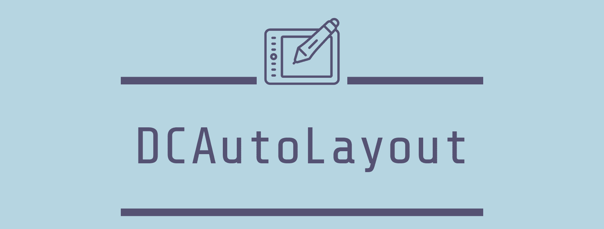

[](https://github.com/SnapKit/SnapKit)
[](https://cocoapods.org/pods/SnapKit)
[](https://github.com/Carthage/Carthage)

## 1. Requirements

- iOS 9.0+ 
- Xcode 10.0+
- Swift 4.2+

## 2. Installation

### 1.CocoaPods

[CocoaPods](http://cocoapods.org) is a dependency manager for Cocoa projects. You can install it with the following command:

```bash
$ gem install cocoapods
```

> CocoaPods 1.1.0+ is required to build DCAutoLayout 1.0.0+.

To integrate DCAutoLayout into your Xcode project using CocoaPods, specify it in your `Podfile`:

```ruby
source 'https://github.com/CocoaPods/Specs.git'
platform :ios, '10.0'
use_frameworks!

target '<Your Target Name>' do
    pod 'DCAutoLayout', '~> 1.0.1'
end
```

Then, run the following command:

```bash
$ pod install
```

### 2.Carthage

[Carthage](https://github.com/Carthage/Carthage) is a decentralized dependency manager that builds your dependencies and provides you with binary frameworks.

You can install Carthage with [Homebrew](http://brew.sh/) using the following command:

```bash
$ brew update
$ brew install carthage
```

To integrate DCAutoLayout into your Xcode project using Carthage, specify it in your `Cartfile`:

```ogdl
github "DarielChen/DCAutoLayout"
```

Run `carthage update` to build the framework and drag the built `DCAutoLayout.framework` into your Xcode project.

### 3.Manually

If you prefer not to use either of the aforementioned dependency managers, you can integrate DCAutoLayout into your project manually.

---

## 3.Usage

### 1.Quick Start

```swift
import DCAutoLayout

class ViewController: UIViewController {
    
    lazy var label = UILabel()

    override func viewDidLoad() {
        super.viewDidLoad()
        
        label.backgroundColor = UIColor.groupTableViewBackground
        view.addSubview(label)
        
        label.layout {
            $0.topAnchor == view.safeAreaTopAnchor + 20
            $0.leadingAnchor == view.leadingAnchor + 20
            $0.trailingAnchor == view.trailingAnchor - 20
            $0.heightAnchor == 44
        }
    }
}
```
### 2.Set superview’s edges with 20pts of padding.

```swift
label.layout {
    $0.topAnchor == view.topAnchor + 20
    $0.leadingAnchor == view.leadingAnchor + 20
    $0.trailingAnchor == view.trailingAnchor - 20
    $0.bottomAnchor == view.bottomAnchor - 20
}
```
Or even shorter:

```
label.layout {
    $0 == view.marign(20, 20, 20, 20)            
}
```
### 3.`>=`、`<=` represent `greaterThanOrEqual`、`lessThanOrEqual`.

You can use `>=` or `<=` to change Anchor.

```swift
label.layout {
    $0.centerAnchor == view.centerAnchor
    $0.widthAnchor == view.bounds.width - 40
    $0.heightAnchor >= 44
}
```

set height to 88pts.

```swift
label.layout {
    $0.heightAnchor == 88
}
```

### 4.Composition
#### marign
```
label.layout {
    $0 == view.marign(20, 20, 20, 20)            
}
```
#### size

```swift
label.layout {
    $0.sizeAnchor == view.size(100, 44)
}
```
#### center

```swift
label.layout {
    $0.centerAnchor == view.centerAnchor
}
```

### 5.updateConstraints

#### Use `>=`、`<=` to updateConstraints.

```swift
label.layout {
    $0.heightAnchor >= 44
}
```
Update constraint.

```swift
label.layout {
    $0.heightAnchor == 88
}
```
#### reset anchor

Set heightAnchor after remove heightAnchor.

```swift
label.layout {
    $0.removeAnchor($0.heightAnchor)
    $0.heightAnchor == 88
}
```

#### clear all anchor

Set any anchor after remove all anchor.

```swift
label.removeAllAnchor()
        
label.layout {
    $0.removeAnchor($0.heightAnchor)
    $0.heightAnchor == 88
}
```
## 4.License

DCAutoLayout is released under the MIT license. See LICENSE for details.


